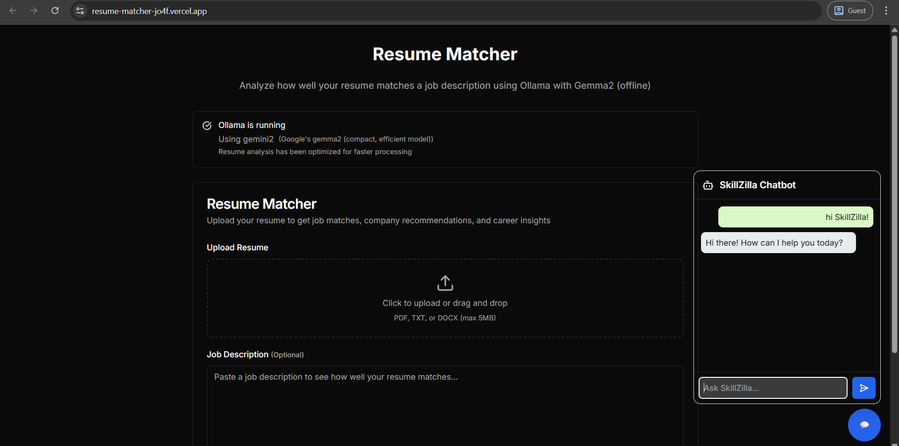
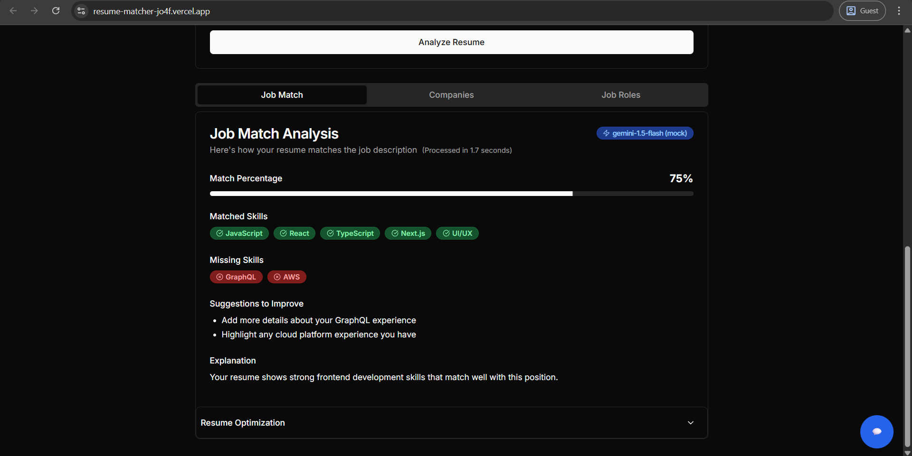
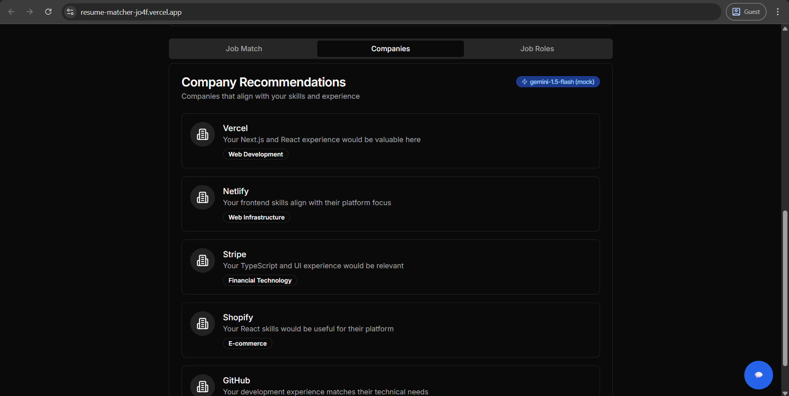
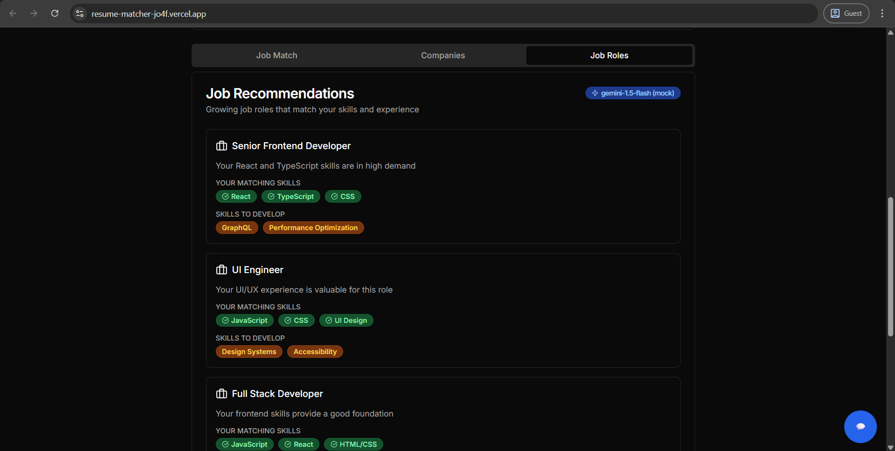

# Resume Matcher with Ollama (Offline)

This project provides a resume matching tool that analyzes how well your resume matches a job description. It uses Ollama with Llama 3 for completely offline AI analysis.

<p align="center">
  <a href="https://resume-matcher-jo4f.vercel.app/" target="_blank">
    
  </a>
   <a href="https://github.com/MADHANKUMAR-C/resume-matcher/stargazers" target="_blank">
  
</a>

</p>

---

## Prerequisites

1. Install Ollama from [ollama.ai](https://ollama.ai)
2. Pull the Llama 3 model:
   
   ```bash
   ollama pull llama3
   ```

---

## Getting Started

1. Clone this repository
2. Install dependencies:
   
   ```bash
   npm install
   ```
   
3. Start the development server:

   ```bash
   npm run dev
   ```
   
4. Make sure Ollama is running in the background
5. Open [http://localhost:3000](http://localhost:3000) in your browser

---

## 🛠 Tech Stack

- [Next.js](https://nextjs.org/) – Frontend framework
- [Node.js](https://nodejs.org/) – Backend runtime
- [Ollama](https://ollama.ai) – Local LLM runtime
- [Llama 3](https://ollama.ai/library/llama3) – AI model

---

## How It Works

This application:
1. Allows you to upload your resume (PDF, TXT, or DOCX)
2. Takes a job description as input
3. Sends both to Ollama running locally with Llama 3
4. Analyzes the match and provides detailed feedback
5. Works completely offline with no internet connection required

---

## ✨ Features

- Match percentage calculation
- Identification of matched skills
- Identification of missing skills
- Suggestions to improve your resume
- Detailed explanation of the analysis

---

##  🖼 Preview

 



 



---

## Troubleshooting

If you encounter errors:

1. Make sure Ollama is running
2. Verify you've pulled the Llama3 model
3. Check that the Ollama API is accessible at http://localhost:11434
4. For better analysis, consider using a more powerful model like Llama3:8b
